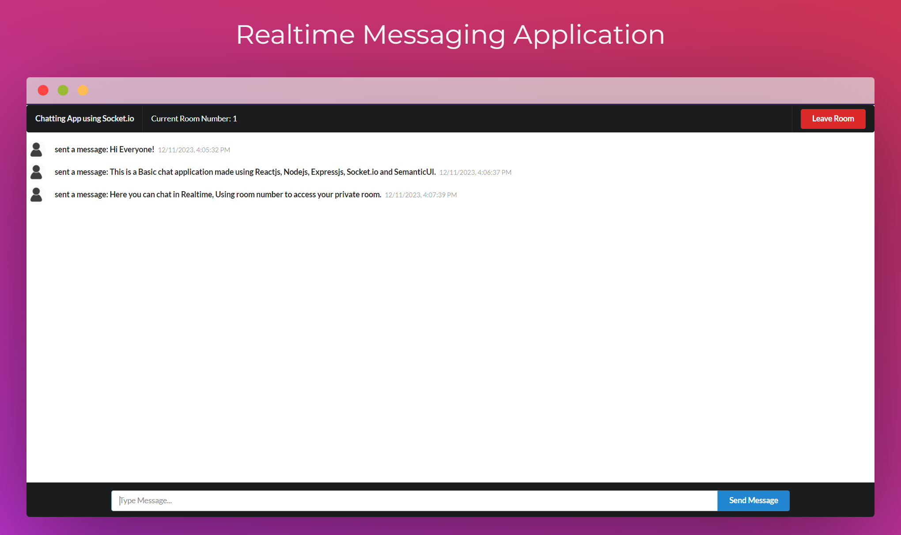

# Realtime Messaging App

A realtime application where users can join distinct chat rooms by specifying room numbers and engage in live conversations with each other. The application provides a straightforward and intuitive user interface, created with ❤️ by Aditya Armal.

## Project Description: Real-Time Chat Application

This project is a interactive real-time chat application that enables users to engage in live conversations in various chat rooms. Built using a robust technology stack, the application seamlessly integrates frontend and backend components to provide a dynamic user experience.

## Key Features:

- Real-Time Communication:
<br>Utilizes Socket.io for enabling bidirectional real-time communication between the server and clients.

- Basic and intuitive user interface:
<br>Developed using ReactJS, the frontend boasts a clean and intuitive user interface.
<br>Semantic UI is employed for styling, ensuring a visually appealing and consistent design throughout the application.

- Node.js and Express Backend:
<br>The backend, powered by Node.js and Express, handles server-side logic and facilitates communication with the frontend.
<br>ExpressJS simplifies the development of robust and scalable web applications, ensuring a smooth user experience.

## What I Learnt/Used

-  : The core library for building the user interface.
-  : A CSS framework that provides pre-designed components and used for styling the user interface.
-  :  Node.js powers the backend of the application, handling server-side logic.
-  : Express.js is the web application framework used with Node.js.
-  : Socket.io enables real-time communication between the server and clients. It facilitates bidirectional communication, crucial for implementing the real-time chat features in the application..


## Tools Used

The following tools were used in the development of this project:

- **Code Editor**: [Visual Studio Code (VS Code)](https://code.visualstudio.com/) was used as the code editor.

## Visual Studio Code Extensions

To enhance your development experience, the following Visual Studio Code extensions were used in this project:

- **ES7+ React/Redux/React-Native snippets**: Provides helpful code snippets for React, Redux, and React Native development.
- **ESLint**: A linter that helps maintain code quality and style.
- **GitHub Theme (Default)**: The GitHub-inspired theme for a clean coding interface.
- **Prettier - Code formatter**: Ensures consistent code formatting and style.

## Prerequisites
Make sure you have the following installed on your machine:

Node.js: https://nodejs.org/
npm (Node Package Manager): Included with Node.js installation.
Getting Started
Clone this repository:

```
git clone https://github.com/your-username/Socket.io-ReactJs-Nodejs.git
```

Navigate to the project directory:

```
cd Socket.io-ReactJs-Nodejs
```

Install dependencies for the server:

```
cd server
npm install
```

Install dependencies for the client:

```
cd ../client
npm install
```

Running the Application
Start the Server
In the server directory, create a .env file with the following content:

```
PORT=3001
```

Adjust the port number if needed.

Run the server:

```
npm start
Start the Client
```
In the client directory, create a .env file with the following content:

```
REACT_APP_SERVER_URL=http://localhost:3001
```

Update the server URL if you are using a different port.

Run the client:

```
npm start
```

Usage
Open your browser and navigate to http://localhost:3000.

Enter a room number and a username to join the chat room.

Contributing
Feel free to contribute to this project by opening issues or submitting pull requests. Your feedback and contributions are highly appreciated.
